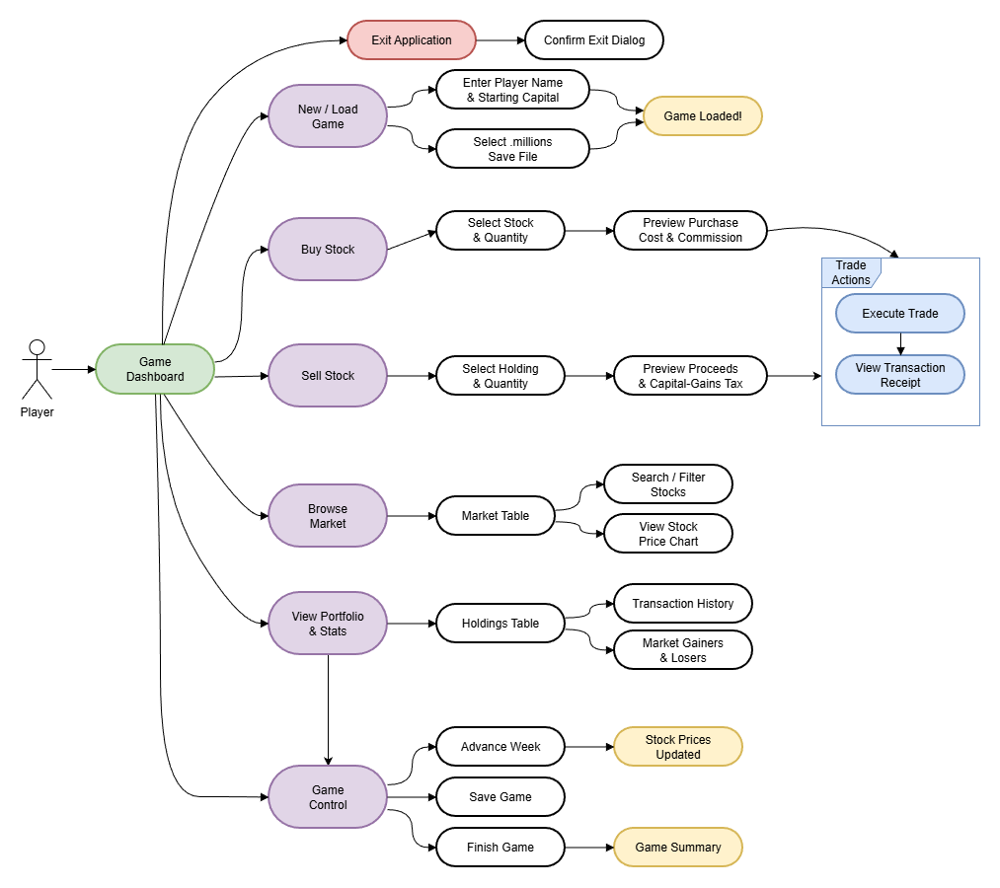

# Portfolio project IDATT2003


## Project description

This is a JavaFX desktop application implemented as the IDATT2003 group project (Group 10).  
The application is a stock market simulation game called **Millions**, where the player buys and sells shares from a configurable stock exchange, advances the game one week at a time to trigger random price changes, and tracks net worth, portfolio performance, and transaction history in real time. The application is built around the MVC pattern, uses the Observer pattern for live UI updates, and persists game state to disk as `.millions` JSON files.





## Project structure

Sources and tests follow a standard Maven layout. The model is fully decoupled from JavaFX, controllers expose DTOs to the views, and a dedicated data access layer handles parsing of stock CSV files and serialization of game state.

Entire project structure:

```
├───src
│   ├───main
│   │   ├───java
│   │   │   └───edu
│   │   │       └───ntnu
│   │   │           └───idi
│   │   │               └───idatt
│   │   │                   ├───controller
│   │   │                   │   ├───dto
│   │   │                   │   └───init
│   │   │                   ├───dal
│   │   │                   │   ├───dto
│   │   │                   │   ├───exception
│   │   │                   │   └───mapper
│   │   │                   ├───model
│   │   │                   │   ├───exception
│   │   │                   │   └───transaction
│   │   │                   ├───observer
│   │   │                   ├───view
│   │   │                   │   ├───component
│   │   │                   │   ├───screen
│   │   │                   │   │   └───tabs
│   │   │                   │   └───util
│   │   │                   └───App.java
│   │   └───resources
│   │       ├───sp500.csv
│   │       └───style.css
│   └───test
│       └───java
│           └───edu
│               └───ntnu
│                   └───idi
│                       └───idatt
│                           ├───dal
│                           │   └───mapper
│                           └───model
│                               └───transaction
```

## Link to repository

https://github.com/mappeG10/mappe-2026-IDATT2003-G10

## GitHub Pages

Javadoc and test coverage reports are published to GitHub Pages:  
https://mappeg10.github.io/mappe-2026-IDATT2003-G10/

## Prerequisites

The following must be installed before building or running the project:

- **Java 25**
- **Maven 3.9+**


## Compile

To compile the project:

```bash
mvn compile
```

For a clean build (removes previous build output before compiling):

```bash
mvn clean compile
```

## Checkstyle

The project enforces Google Java Style via the `maven-checkstyle-plugin`. To check for style violations:

```bash
mvn checkstyle:check
```

Violations are printed to the console and the build fails if any are found.

To automatically format the source code to match the style rules, run:

```bash
mvn fmt:format
```

## How to run the project

The project is set up with the JavaFX Maven plugin, which is configured to launch `edu.ntnu.idi.idatt.App` as the main class.  
To start the project this way, simply enter the following command in the terminal

- run: `mvn javafx:run`

However, it is necessary to have compiled the correct classes before running.
The recommended command to ensure a clean run:

- Build and run: `mvn clean compile javafx:run`

When the application launches, the start screen lets you enter a player name, a starting capital, and select an arbitrary stock data CSV file from anywhere on the file system (a sample file, `sp500.csv`, is bundled in `src/main/resources`). Previously saved games can be reopened via the "Load Game" button on the start screen.

The CSV format expected by the application is one stock per line with three comma-separated columns; lines starting with `#` and blank lines are ignored:

```
# Ticker,Name,Price
NVDA,Nvidia,191.27
AAPL,Apple Inc.,276.43
```

## How to run the tests

You can run the tests by running the following command in the terminal
`mvn test`

The test suite runs entirely on JUnit Jupiter and does not require a display, so it can be executed in headless CI environments. Coverage reports are produced by JaCoCo into `target/jacoco/coverage-reports/` when running `mvn verify`.

## References

* [Maven](https://maven.apache.org/guides/index.html)
* [JavaFX Maven plugin](https://github.com/openjfx/javafx-maven-plugin)
* [OpenJFX documentation](https://openjfx.io/openjfx-docs/)
* [JUnit 5](https://junit.org/junit5/docs/current/user-guide/)
* [Jackson Databind](https://github.com/FasterXML/jackson-databind)
* [JaCoCo](https://www.jacoco.org/jacoco/trunk/doc/)

